# Sentinel Agent

> Agentic AI security platform for automated DevSecOps vulnerability detection, analysis, remediation, and verification.

Sentinel Agent is a Python-based cybersecurity platform that combines traditional security scanners with AI-assisted vulnerability analysis and controlled remediation.

The platform follows a security-first workflow:

**Detect → Analyze → Remediate → Validate → Approve → Apply → Rescan**

Sentinel Agent integrates **Bandit**, **Gitleaks**, and **pip-audit** to identify security issues, normalizes their findings into a common security model, uses AI to analyze vulnerabilities and generate remediation patches, validates those patches, performs a dry-run before modification, calculates remediation confidence, requires human approval, applies the patch, and finally rescans the application to verify the result.

---

## Table of Contents

- [Overview](#overview)
- [Key Features](#key-features)
- [Architecture](#architecture)
- [Security Detection Flow](#security-detection-flow)
- [Agentic Remediation Flow](#agentic-remediation-flow)
- [Finding Normalization](#finding-normalization)
- [AI Security Analysis](#ai-security-analysis)
- [AI Remediation](#ai-remediation)
- [Patch Validation](#patch-validation)
- [Patch Dry-Run](#patch-dry-run)
- [Confidence Scoring](#confidence-scoring)
- [Human Approval](#human-approval)
- [Safe Patch Application](#safe-patch-application)
- [Post-Remediation Verification](#post-remediation-verification)
- [Audit Logging](#audit-logging)
- [CI/CD Security Gate](#cicd-security-gate)
- [Security Model](#security-model)
- [Threat Model](#threat-model)
- [Installation](#installation)
- [Configuration](#configuration)
- [Usage](#usage)
- [Testing](#testing)
- [Project Structure](#project-structure)
- [Development Workflow](#development-workflow)
- [Production Hardening](#production-hardening)
- [Current Project Status](#current-project-status)
- [Future Improvements](#future-improvements)
- [Skills Demonstrated](#skills-demonstrated)

---

# Overview

Modern application security programs can detect vulnerabilities successfully but often leave developers responsible for determining how to fix them.

Sentinel Agent extends the traditional security scanning model by adding AI-assisted remediation while maintaining security controls around automated changes.

Instead of stopping at:

```text
Vulnerability Detected
        ↓
Security Report
        ↓
Developer Fixes Manually
```

Sentinel Agent provides:

```text
Vulnerability Detected
        ↓
Finding Normalized
        ↓
AI Security Analysis
        ↓
AI Remediation Generated
        ↓
Patch Validated
        ↓
Patch Dry-Run
        ↓
Confidence Evaluated
        ↓
Human Approval
        ↓
Patch Applied
        ↓
Security Rescan
        ↓
Remediation Verified
```

The objective is not unrestricted autonomous code modification.

The system is intentionally designed with multiple security boundaries between AI-generated output and actual source-code modification.

---

# Key Features

| Capability | Description |
|---|---|
| Static Analysis | Bandit-based Python security scanning |
| Secret Detection | Gitleaks integration |
| Dependency Security | pip-audit integration |
| Finding Normalization | Common security finding model |
| Finding Prioritization | Severity-based prioritization |
| AI Security Analysis | AI-assisted vulnerability analysis |
| AI Remediation | AI-generated unified diff patches |
| Patch Validation | Structural and path validation |
| Patch Dry-Run | Safe pre-application testing |
| Confidence Scoring | Evidence-based remediation confidence |
| Human Approval | Explicit approval before modification |
| Safe Patch Application | Controlled source modification |
| Security Rescan | Verification after remediation |
| Audit Logging | JSONL remediation audit trail |
| CI/CD Gate | Security scanning for pipelines |

---

# Architecture

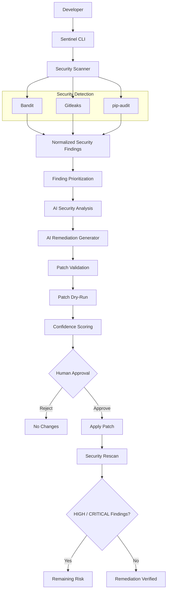

---

# Security Detection Flow

Sentinel Agent uses multiple security tools to provide layered detection.

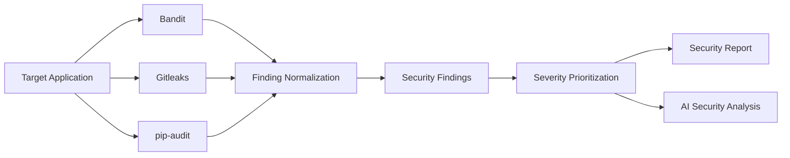

---

# Agentic Remediation Flow

The remediation workflow combines AI assistance with deterministic security controls and human approval.

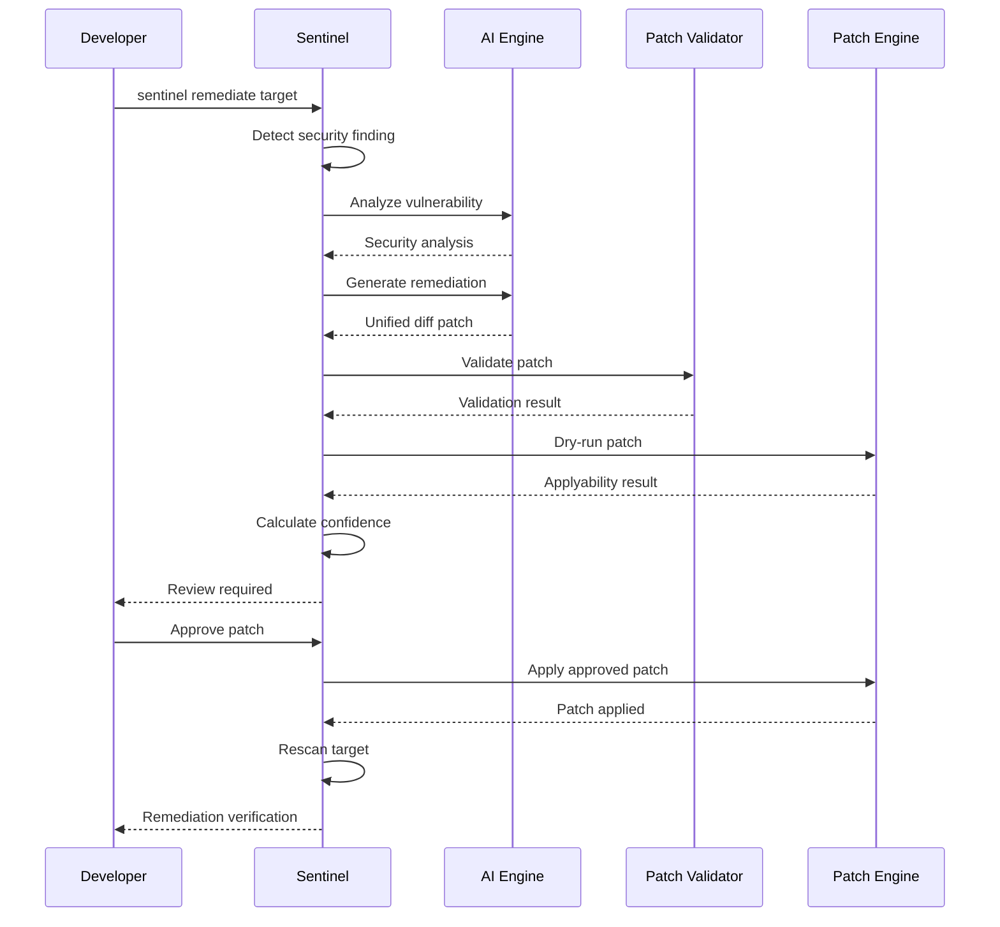

---

# Finding Normalization

Different security tools produce different output formats.

Sentinel Agent converts scanner results into a common `SecurityFinding` model.

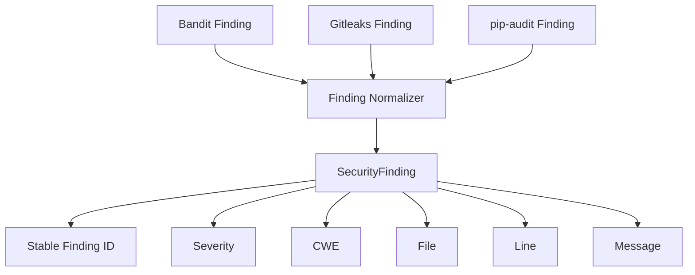

The normalized model contains fields such as:

```text
tool
rule
severity
file
line
message
cwe
code
finding_id
```

Stable finding IDs provide a consistent reference for security reporting and future workflow automation.

---

# Finding Prioritization

Findings are prioritized according to severity.

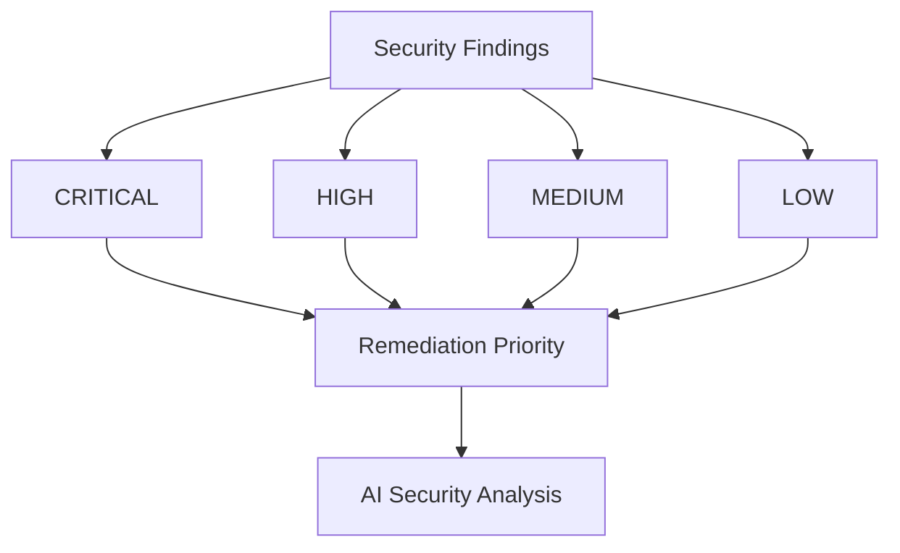

The remediation workflow focuses attention on higher-risk vulnerabilities first.

---

# AI Security Analysis

The AI analysis layer interprets normalized security findings.

The AI receives security context and returns structured information such as:

```json
{
  "risk": "...",
  "explanation": "...",
  "impact": "...",
  "recommendation": "..."
}
```

The AI layer assists with:

- Risk interpretation
- Vulnerability explanation
- Potential impact
- Recommended remediation
- Security context

AI output is treated as untrusted information and does not directly modify source code.

---

# AI Remediation

When remediation is requested, Sentinel Agent asks the AI system to generate a structured remediation response.

The response includes:

- Summary
- Explanation
- Fixed code
- Unified diff
- Changes
- Testing recommendations

The unified diff is the artifact passed into the patch validation pipeline.

Example:

```diff
--- vulnerable_app/app.py
+++ vulnerable_app/app.py
@@ -18,5 +18,5 @@
         user_input,
-        shell=True,
+        shell=False,
         capture_output=True,
         text=True
     )
```

---

# Patch Validation

AI-generated patches are treated as untrusted input.

Before a patch can be applied, Sentinel Agent validates its structure and file references.

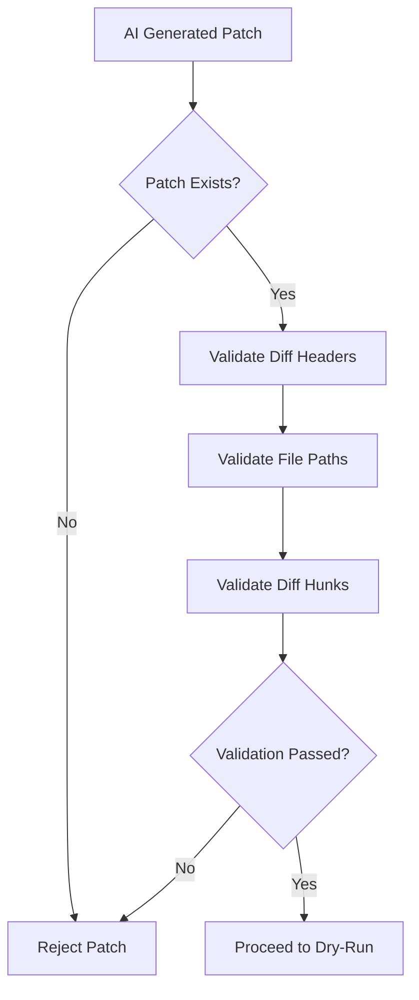

Validation checks include:

- Patch is not empty
- Unified diff headers exist
- Target files are referenced
- Patch hunks exist
- Referenced files remain within the target directory

---

# Patch Path Security

Patch paths are explicitly checked before application.

A remediation patch must not escape the intended target directory.

For example, a patch attempting to modify:

```text
../../etc/passwd
```

must be rejected.

Sentinel Agent resolves referenced paths and verifies that they remain inside the configured target directory.

---

# Patch Dry-Run

Before modifying source code, Sentinel Agent tests whether the patch can actually be applied.

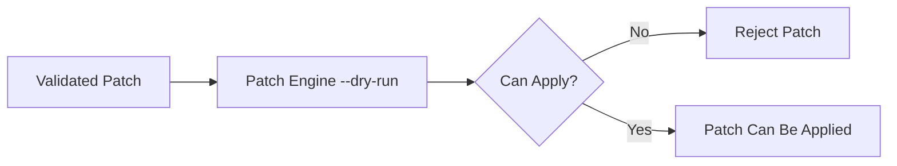

Dry-run validation can detect:

- Malformed patches
- Invalid context
- Invalid hunks
- Incorrect file references
- Patches that cannot be cleanly applied

The dry-run does not modify source files.

---

# Confidence Scoring

Sentinel Agent evaluates the evidence surrounding a proposed remediation patch.

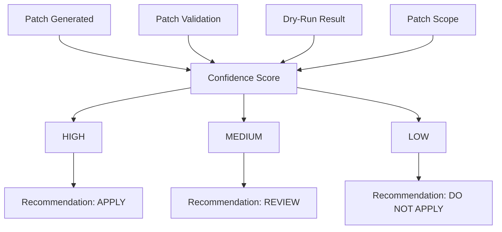

The current scoring model considers:

| Evidence | Score |
|---|---:|
| Patch generated | +1 |
| Patch validation succeeds | +2 |
| Dry-run succeeds | +3 |
| Exactly one file modified | +2 |

Confidence levels:

| Score | Confidence | Recommendation |
|---:|---|---|
| 7–8 | HIGH | APPLY |
| 4–6 | MEDIUM | REVIEW |
| 0–3 | LOW | DO NOT APPLY |

Example:

```text
=== Remediation Decision ===

Confidence: HIGH
Recommendation: APPLY
Score: 8
```

Confidence scoring does not bypass human approval.

---

# Human Approval

Sentinel Agent requires explicit human approval before modifying source code.

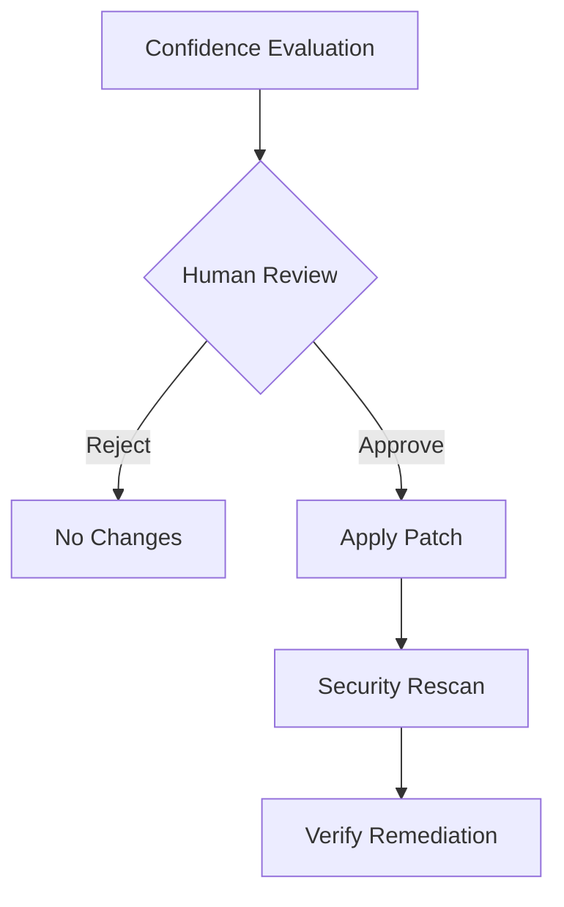

The approval prompt uses a secure default:

```text
Apply these patches? [y/N]:
```

The default response is `N`.

Even a high-confidence patch must be explicitly approved.

---

# Safe Patch Application

The complete patch application control flow is:

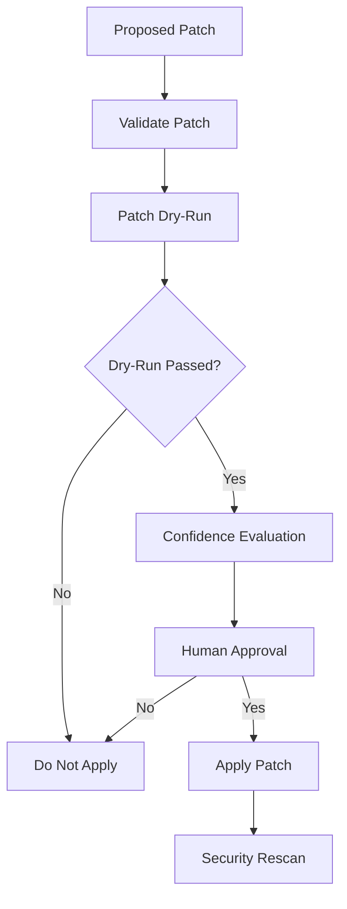

This provides multiple security controls before source modification.

---

# Post-Remediation Verification

A patch being applied successfully does not automatically mean the vulnerability has been fixed.

Sentinel Agent performs a security rescan after remediation.

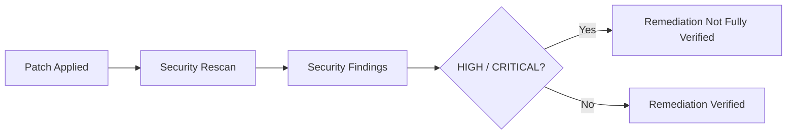

Successful remediation requires the post-remediation scan to show no remaining `HIGH` or `CRITICAL` findings.

Example:

```text
Patch Validation: VALID

Apply these patches? [y/N]: y

Patch applied successfully.

=== Rescanning ===

Remediation verification: PASSED

No HIGH or CRITICAL findings remain.
```

---

# Audit Logging

Sentinel Agent records remediation activity in a JSON Lines audit file.

Default audit file:

```text
sentinel_audit.jsonl
```

Audit events can contain:

- Timestamp
- Event type
- Target
- Finding information
- Remediation information
- Execution details

The audit file is excluded from source control.

---

# CI/CD Security Gate

Sentinel Agent can be incorporated into CI/CD pipelines as a security gate.

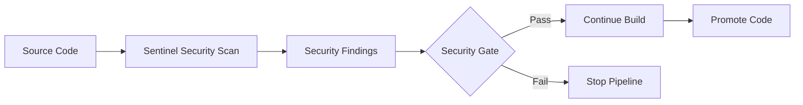

The scanner can return a non-zero exit status when security findings meet the configured failure conditions.

This allows security checks to become part of the normal development lifecycle.

---

# Security Model

Sentinel Agent follows a defense-in-depth security model.

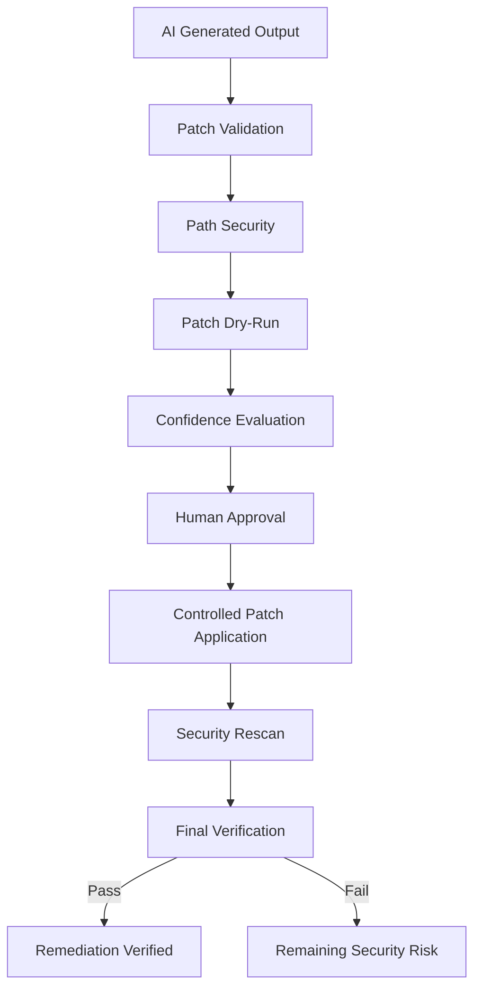

The AI model is not considered a trusted execution environment.

Instead, AI-generated changes must pass deterministic security controls before they can reach the filesystem.

---

# Security Boundaries

## Boundary 1 — Scanner Output

Scanner output is parsed and normalized before entering the AI workflow.

## Boundary 2 — AI Output

AI-generated remediation is treated as untrusted data.

## Boundary 3 — Patch Validation

The patch must pass structural and path validation.

## Boundary 4 — Dry-Run

The patch must be applicable by the system patch engine.

## Boundary 5 — Human Approval

The developer must explicitly approve the remediation.

## Boundary 6 — Post-Remediation Scan

The target application is rescanned after modification.

---

# Threat Model

Sentinel Agent considers several risks associated with AI-assisted remediation.

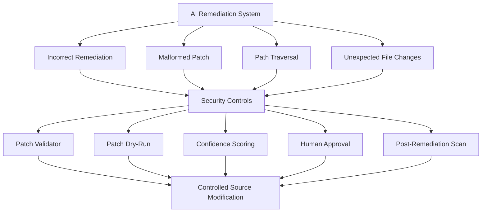

| Threat | Mitigation |
|---|---|
| Malformed AI patch | Patch validation |
| Path traversal | Target path validation |
| Incorrect patch context | Dry-run |
| AI hallucinated remediation | Validation and rescan |
| Unexpected source modification | Human approval |
| Multi-file unexpected changes | Confidence scoring |
| Secrets in source | Gitleaks |
| Vulnerable dependencies | pip-audit |
| Python security issues | Bandit |
| Failed remediation | Post-remediation rescan |

---

# Example Vulnerability

The repository contains an intentionally vulnerable application for security testing.

Example:

```python
subprocess.run(
    user_input,
    shell=True,
    capture_output=True,
    text=True
)
```

Bandit identifies this pattern as a high-severity security issue.

Example:

```text
Tool: Bandit
Rule: B602
Severity: HIGH
CWE: 78
Issue: subprocess call with shell=True
```

The AI remediation workflow can generate:

```diff
-        shell=True,
+        shell=False,
```

The proposed remediation then passes through:

```mermaid
flowchart LR
    FINDING[Security Finding]

    FINDING --> ANALYSIS[AI Analysis]

    ANALYSIS --> PATCH[AI Patch]

    PATCH --> VALIDATE[Patch Validation]

    VALIDATE --> DRYRUN[Dry-Run]

    DRYRUN --> CONFIDENCE[Confidence]

    CONFIDENCE --> APPROVAL[Human Approval]

    APPROVAL --> APPLY[Apply Patch]

    APPLY --> RESCAN[Security Rescan]

    RESCAN --> VERIFIED[Verified]
```

---

# Dry-Run vs Real Remediation

## Dry-Run

Dry-run remediation:

- Generates remediation
- Validates the patch
- Performs patch dry-run
- Calculates confidence
- Does not modify source files

Command:

```bash
sentinel remediate vulnerable_app/ --dry-run
```

Workflow:

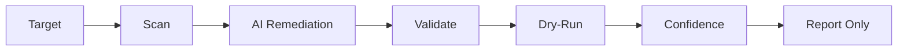

---

## Real Remediation

Real remediation:

- Generates remediation
- Validates the patch
- Performs patch dry-run
- Calculates confidence
- Requests human approval
- Applies the patch
- Rescans the target

Command:

```bash
sentinel remediate vulnerable_app/
```

Workflow:

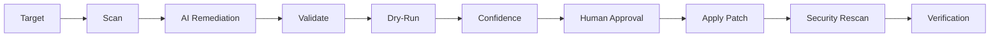

---

# Installation

## Requirements

Sentinel Agent currently requires:

- Python 3.13+
- Git
- Gitleaks
- OpenAI API access for AI-assisted analysis and remediation

---

## Clone the Repository

```bash
git clone https://github.com/reggied2758/sentinel-agent.git
cd sentinel-agent
```

---

## Create a Virtual Environment

```bash
python3 -m venv .venv
```

Activate it:

```bash
source .venv/bin/activate
```

---

## Install Sentinel Agent

```bash
pip install .
```

The project dependencies are defined in `pyproject.toml`.

---

# Gitleaks Installation

On macOS using Homebrew:

```bash
brew install gitleaks
```

Verify:

```bash
gitleaks version
```

Gitleaks is installed as an external security tool rather than a Python package dependency.

---

# Configuration

Sentinel Agent uses the OpenAI API for AI-assisted security analysis and remediation.

Set the API key in your environment:

```bash
export OPENAI_API_KEY="your-api-key"
```

Never commit API keys, passwords, or other credentials to Git.

---

# Usage

After installation:

```bash
sentinel --help
```

---

## Security Scan

Scan a target application:

```bash
sentinel scan vulnerable_app/
```

---

## Remediation

Run interactive remediation:

```bash
sentinel remediate vulnerable_app/
```

The workflow:

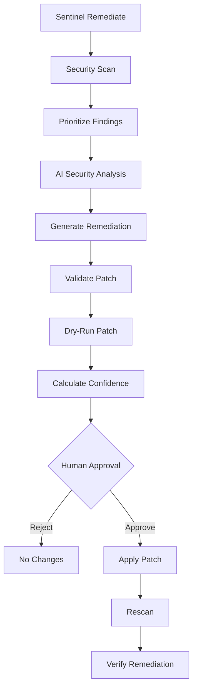

---

# Example CLI Session

```text
$ sentinel remediate vulnerable_app/

=== Security Scan ===

Tool: Bandit
Rule: B602
Severity: HIGH
File: vulnerable_app/app.py
Line: 19

=== AI Security Analysis ===

Risk: HIGH

Explanation:
The application passes user-controlled input to a shell-enabled
subprocess invocation.

Recommendation:
Avoid shell execution and pass command arguments directly.

=== AI Remediation ===

Generated unified diff.

=== Patch Validation ===

Patch Validation: VALID

=== Patch Dry-Run ===

Patch can be applied successfully.

=== Remediation Decision ===

Confidence: HIGH
Recommendation: APPLY
Score: 8

=== Human Approval ===

Apply these patches? [y/N]: y

Patch applied successfully.

=== Rescanning ===

Remediation verification: PASSED

No HIGH or CRITICAL findings remain.
```

---

# Testing

Sentinel Agent includes automated tests for core security workflows.

Run:

```bash
pytest
```

The test suite covers areas including:

- Finding normalization
- Scanner behavior
- Patch validation
- Patch application
- Patch dry-run
- Confidence scoring
- Remediation workflow behavior

Example result:

```text
24 passed
```

---

# Project Structure

```text
sentinel-agent/
│
├── agent/
│   ├── __init__.py
│   ├── ai_analyzer.py
│   ├── audit_log.py
│   ├── patch_applier.py
│   ├── patch_confidence.py
│   ├── patch_validator.py
│   ├── remediation.py
│   └── security_agent.py
│
├── scanner/
│   ├── __init__.py
│   ├── __main__.py
│   ├── bandit_scanner.py
│   ├── gitleaks_scanner.py
│   └── pip_audit_scanner.py
│
├── security/
│   ├── __init__.py
│   └── models.py
│
├── ai_security/
│   ├── __init__.py
│   └── ...
│
├── tests/
│   ├── ...
│   └── test_patch_confidence.py
│
├── vulnerable_app/
│   └── app.py
│
├── .bandit
├── .gitignore
├── pyproject.toml
└── README.md
```

---

# Development Workflow

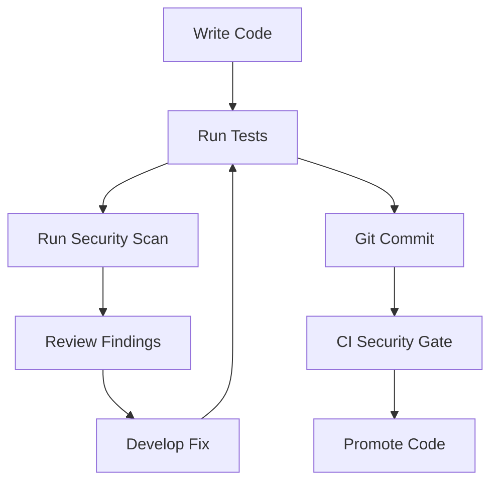

Recommended development cycle:

```bash
pytest
```

Then:

```bash
sentinel scan .
```

Review security findings before committing changes.

---

# Production Hardening

Sentinel Agent is currently a project implementation rather than a fully hardened enterprise production platform.

Potential production hardening areas include:

## Sandboxed Remediation

AI-generated patches should ideally be tested in an isolated environment before modifying important repositories.

## Repository Isolation

Production deployments should restrict remediation to explicitly authorized repositories and paths.

## Authentication

If exposed as a service, Sentinel Agent should use authenticated access.

## Authorization

Role-based authorization could control:

- Scan
- Analyze
- Approve
- Remediate
- Configure

## Secrets Management

Production deployments should use a dedicated secrets-management solution.

## Enhanced Patch Policies

Future policy controls could include:

```text
Allowed Files
Allowed Extensions
Maximum Files Changed
Maximum Lines Changed
Allowed Commands
Blocked Directories
Required Approval Level
Minimum Confidence
```

---

# Current Security Controls

| Control | Status |
|---|---|
| Static Python security scanning | Implemented |
| Secret detection | Implemented |
| Dependency vulnerability scanning | Implemented |
| Finding normalization | Implemented |
| Finding prioritization | Implemented |
| AI vulnerability analysis | Implemented |
| AI remediation generation | Implemented |
| Patch structure validation | Implemented |
| Patch path validation | Implemented |
| Patch dry-run | Implemented |
| Confidence scoring | Implemented |
| Human approval | Implemented |
| Safe patch application | Implemented |
| Post-remediation rescan | Implemented |
| Audit logging | Implemented |
| CI/CD security gate | Implemented |
| Production sandboxing | Future |
| Enterprise RBAC | Future |
| Centralized dashboard | Future |

---

# Current Project Status

## Phase 1 — Security Detection

**Completed**

- Bandit integration
- Gitleaks integration
- pip-audit integration
- Scanner normalization
- Severity prioritization

## Phase 2 — Intelligence & Reporting

**Completed**

- AI security analysis
- Structured risk explanations
- Remediation recommendations
- Normalized findings

## Phase 3 — CI/CD Security Gate

**Completed**

- Security scan exit codes
- CI-friendly scanning
- Dependency security checks

## Phase 4 — Intelligent Remediation

**Completed**

- AI remediation generation
- Unified diff generation
- Patch validation
- Patch dry-run
- Safe application

## Phase 5 — Agentic Remediation

**Completed**

- Automated remediation workflow
- Human approval
- Confidence scoring
- Automatic security rescan
- Remediation verification
- Audit logging

## Phase 6 — Production Hardening

**In Progress**

---

# Complete End-to-End Workflow

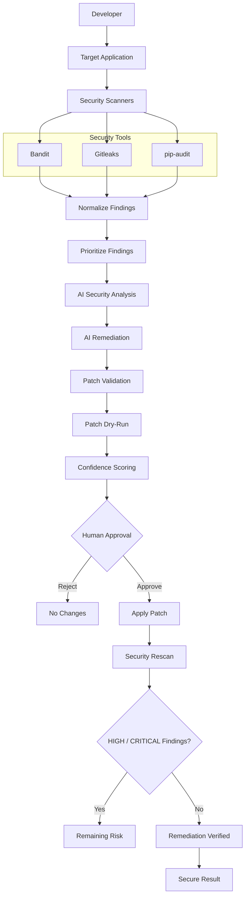

---

# Design Principles

## Security First

Security controls take precedence over AI convenience.

## AI as an Assistant

AI generates analysis and remediation proposals.

It does not receive unrestricted authority to modify source code.

## Human in the Loop

Final remediation approval remains with the developer.

## Defense in Depth

Multiple independent controls protect against incorrect or malicious remediation output.

## Verify Everything

A patch is not considered successful simply because it was applied.

The target is rescanned after remediation.

## Fail Safely

When validation or dry-run checks fail, the proposed patch is rejected.

---

# Skills Demonstrated

This project demonstrates practical experience across multiple cybersecurity and software engineering domains.

## Application Security

- Static Application Security Testing
- Vulnerability detection
- CWE mapping
- Security severity classification
- Secure coding remediation

## DevSecOps

- CI/CD security gates
- Automated vulnerability scanning
- Dependency security
- Secret detection
- Security-focused testing

## AI Security Engineering

- AI-assisted vulnerability analysis
- AI-generated remediation
- Structured AI output
- AI output validation
- Confidence scoring
- Human-in-the-loop security controls

## Secure Automation

- Patch validation
- Patch dry-run
- Safe filesystem handling
- Automated verification
- Audit logging

## Python Engineering

- CLI development
- Modular architecture
- Dataclasses
- Subprocess management
- Automated testing
- Python packaging

---

# Future Improvements

Potential future capabilities include:

## Advanced Remediation Policies

Configurable policies for:

- Maximum files changed
- Maximum lines changed
- Allowed directories
- Blocked directories
- Allowed file types
- Minimum confidence
- Required approval level

## Repository-Aware Remediation

Allow Sentinel Agent to understand:

- Git history
- Project architecture
- Existing coding patterns
- Test suites
- Dependency relationships

## Automated Testing

After remediation:

```mermaid
flowchart LR
    PATCH[Patch Applied]

    PATCH --> UNIT[Unit Tests]

    UNIT --> SECURITY[Security Scan]

    SECURITY --> INTEGRATION[Integration Tests]

    INTEGRATION --> VERIFY[Verification]

    VERIFY --> RESULT[Remediation Result]
```

## Git Integration

Future versions could:

- Create remediation branches
- Commit patches
- Generate pull requests
- Attach security findings
- Attach remediation reports

## Security Dashboard

A future dashboard could provide:

- Vulnerability inventory
- Severity trends
- Remediation status
- AI confidence
- Patch history
- Audit events
- CI/CD security results

## Enterprise Security

Potential enterprise capabilities:

- RBAC
- SSO
- Centralized audit logging
- Repository authorization
- Policy management
- Multi-tenant isolation
- Security event integrations

---

# Project Goals

Sentinel Agent demonstrates how AI can be incorporated into a modern DevSecOps workflow while preserving important security boundaries.

The project focuses on:

```mermaid
flowchart LR
    DETECT[Detection]
    INTELLIGENCE[Intelligence]
    AUTOMATION[Controlled Automation]
    HUMAN[Human Oversight]
    VERIFY[Verification]

    DETECT --> INTELLIGENCE
    INTELLIGENCE --> AUTOMATION
    AUTOMATION --> HUMAN
    HUMAN --> VERIFY
```

The objective is not to create an unrestricted autonomous coding agent.

The objective is to create a **security-focused remediation agent with explicit controls around AI-generated changes**.

---

# Why Sentinel Agent?

Traditional scanners answer:

> **"What is wrong?"**

Sentinel Agent attempts to answer:

> **"What is wrong, why does it matter, how can it be fixed, can the fix be safely applied, and did the fix actually work?"**

That distinction is the foundation of the project.

---

# Example Remediation Policy

A future policy could enforce:

```mermaid
flowchart TD
    FINDING[HIGH or CRITICAL Finding]

    FINDING --> AI[AI Remediation]

    AI --> VALIDATE[Patch Validation]

    VALIDATE --> DRYRUN[Dry-Run]

    DRYRUN --> CONFIDENCE{HIGH Confidence?}

    CONFIDENCE -->|No| REVIEW[Manual Review]

    CONFIDENCE -->|Yes| APPROVAL[Human Approval]

    APPROVAL -->|Reject| STOP[Stop]

    APPROVAL -->|Approve| APPLY[Apply Patch]

    APPLY --> RESCAN[Security Rescan]

    RESCAN --> VERIFY[Verification]
```

This represents the intended security philosophy:

> **Automation should increase security velocity without removing security controls.**

---

# Conclusion

Sentinel Agent combines traditional security scanning with AI-assisted remediation while maintaining a human-controlled security boundary.

The complete workflow is:

```mermaid
flowchart LR
    DETECT[Detect]

    DETECT --> ANALYZE[Analyze]

    ANALYZE --> REMEDIATE[Remediate]

    REMEDIATE --> VALIDATE[Validate]

    VALIDATE --> APPROVE[Approve]

    APPROVE --> APPLY[Apply]

    APPLY --> RESCAN[Rescan]

    RESCAN --> VERIFY[Verify]
```

The result is a security automation platform that demonstrates how AI can assist with vulnerability remediation without giving AI unrestricted authority over source code.

---

# Author

**Reginald Quarshie**

Cybersecurity-focused software engineering project demonstrating:

- Application Security
- DevSecOps
- AI Security Engineering
- Secure Automation
- Vulnerability Management
- Python Development
- CI/CD Security